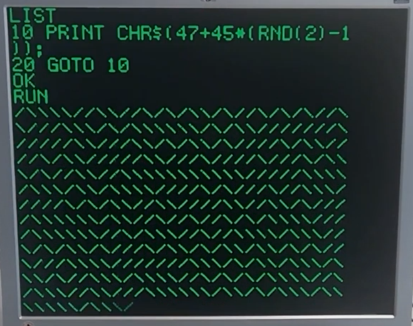
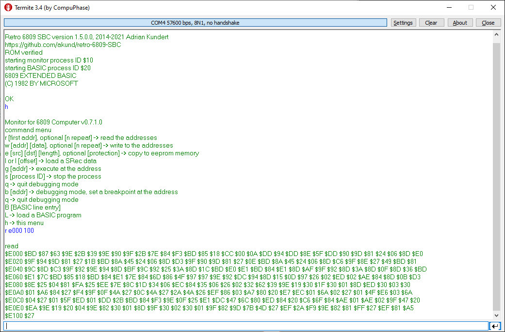
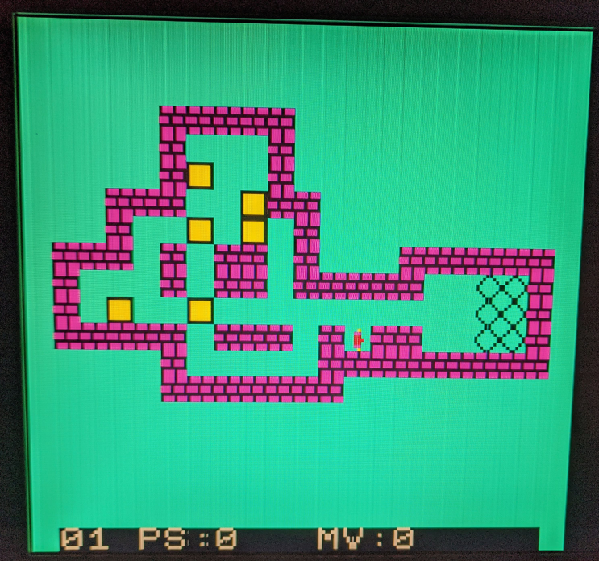

# retro-6809-SBC
6809 based single board computer

COPYRIGHT (C) 2018-2023 Adrian Kundert  
[adrian.kundert@gmail.com](mailto:adrian.kundert@gmail.com)  

The [retro 6809 SBC](doc/Retro_6809_SBC.pdf) is a homebrew 8-bit computer running BASIC as made in the 80's but with sound and more modern peripherals like PS/2 keyboard, VGA output and SD card.
The system has 32 KB RAM for a MPU clocked at 8 MHz.

# Features Overview

# Demo

## Microsoft Color Computer Basic (based on [Grant Searle](http://searle.x10host.com/6809/Simple6809.html)) reworked source code.
## Color Computer Basic DISK (SD card capabilities based on CC Dharmani ExploreEmbedded) 
### Included tokens
#### (From the Color BASIC ROM)

FOR, GO, REM, ELSE, IF, DATA, PRINT, ON GOSUB, ON GOTO, INPUT, LINE INPUT, END, NEXT, DIM, READ, RUN, RESTORE, RETURN, STOP, POKE, CONT, LIST, CLEAR, SET, CLS, SOUND, NEW, EXEC, TAB, TO, SUB, THEN, NOT, STEP, +, -, *, /, ^, AND, OR, >, =, <

#### (From the Extended BASIC ROM)

DEL, DEF, LET, RENUM, FN, USING, &, &H, TRON, TROFF, EDIT

#### (From the Disk BASIC ROM)

DIR, LOAD, SAVE, KILL

### Secondary functions

#### (From the Color BASIC ROM)
SGN, INT, ABS, USR, RND, SIN, PEEK, LEN, STR$, VAL, ASC, CHR$, LEFT$, RIGHT$, MID$, INKEY$, MEM

#### (From the Extended BASIC ROM)
ATN, COS, TAN, EXP, FIX, LOG, SQR, HEX$, VARPTR, INSTR, STRING$, MID$ (MODIFICATION), POS

The BASIC commands can be entered with the keyboard at the prompt or from Terminal (see below)

## Monitor usage with the Terminal
The Monitor is an assistance tool for debugging by accessign the memory and sending BASIC command (override the keyboard).
By the Terminal command "h\r" the Help Menu is shown.

1. A [BASIC file](basic/pong.bas) can be send to the retro 6809 SBC with the command "L"
a message "send now the BAS file" is prompt before you can send the BASIC file.

2. A SREC file can be loaded in the memory with the command "l\r" and then execute "g\r".
Important when another program is loaded, the command "S 20\r" is required free the RAM occupied by the BASIC process (ID 0x20).
As an exemple, the program [SOKOBAN](sokoban/sokobanC.s19) starting at adress 0x2000 is loaded ("l\r") into the RAM and executed ("g 2000\r").

## C cross-compiler
The PC application "mc.exe" is an ANSI C89 cross-compiler for the [SOKOBAN](sokoban/main.c) program targeting the 6809 MPU. 

