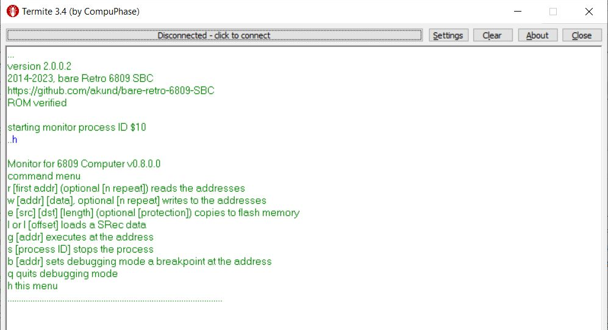

# retro-6809-SBC
6809 based single board computer

COPYRIGHT (C) 2018-2021 Adrian Kundert  
[adrian.kundert@gmail.com](mailto:adrian.kundert@gmail.com)  

# Introduction:

The [retro 6809 SBC](doc/Retro_6809_SBC.pdf) is a homebrew 8-bit computer running BASIC as made in the 80's but with more modern peripherals like PS/2 keyboard and VGA output.

# Features Overview:

# Demo

## BASIC commands

## Monitor usage with the Terminal

A [BASIC file](basic/pong.bas) can be send to the retro 6809 SBC with the command "L"
a message "send now the BAS file" is prompt before you can send the BASIC file.

